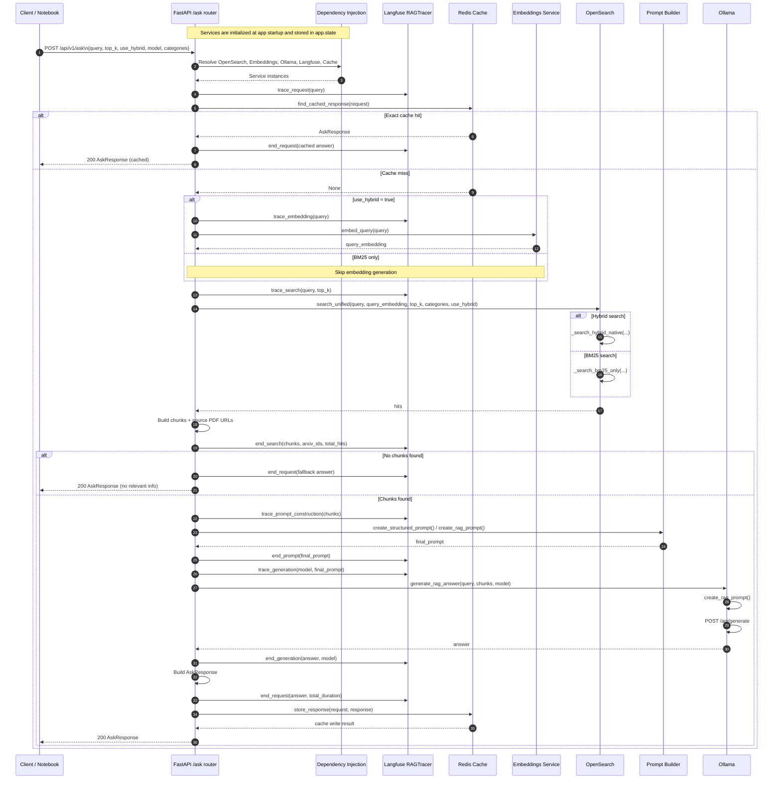

# `/api/v1/ask` End-to-End Flow

This document explains how the Week 6 `POST /api/v1/ask` endpoint works from the first HTTP request to the final JSON response.

It is written for contributors who want to understand the runtime control flow, the role of each component, and the exact handoff points between routing, retrieval, generation, caching, and tracing.

## Sequence Diagram



## Step-by-Step Walkthrough

### 1. Application startup wires the services

When the API process starts, the FastAPI lifespan function creates the shared services and stores them on `app.state`. That includes OpenSearch, the embeddings client, the Ollama client, the Langfuse tracer, and the Redis cache client.

Code anchors:

- `lifespan(...)` in `src/main.py`
- `app.include_router(...)` in `src/main.py`

Why it matters:

The `/ask` route does not construct those dependencies on each request. It receives already-initialized service instances through FastAPI dependency injection.

### 2. The client sends the request payload

The notebook or frontend sends a `POST` request to `/api/v1/ask`. The payload is validated against `AskRequest`, which defines the public contract:

- `query`: the user question
- `top_k`: number of chunks to retrieve
- `use_hybrid`: whether to use embeddings plus BM25
- `model`: Ollama model name
- `categories`: optional arXiv category filters

If the payload is invalid, FastAPI rejects it before the route body runs.

Code anchors:

- `AskRequest` in `src/schemas/api/ask.py`
- `ask_question(...)` in `src/routers/ask.py`

### 3. FastAPI resolves request-scoped dependencies

Before entering the main route logic, FastAPI resolves the dependencies declared in the function signature:

- `opensearch_client`
- `embeddings_service`
- `ollama_client`
- `langfuse_tracer`
- `cache_client`

Each of these is pulled from `request.app.state` by a small dependency function.

Code anchors:

- `get_opensearch_client(...)` in `src/dependencies.py`
- `get_embeddings_service(...)` in `src/dependencies.py`
- `get_ollama_client(...)` in `src/dependencies.py`
- `get_langfuse_tracer(...)` in `src/dependencies.py`
- `get_cache_client(...)` in `src/dependencies.py`

### 4. The route opens a Langfuse request trace

The route wraps the full request in `RAGTracer.trace_request(...)`. This establishes the top-level trace for the request and allows child spans for embeddings, retrieval, prompt construction, and generation.

Code anchors:

- `RAGTracer(...)` usage in `src/routers/ask.py`
- `trace_request(...)` in `src/services/langfuse/tracer.py`

Why it matters:

This is the main observability boundary. Everything interesting in the RAG path is meant to show up underneath this trace.

### 5. The route checks Redis before doing expensive work

The first runtime branch is the cache lookup. If Redis contains an exact match for the full request, the route returns immediately with the cached `AskResponse`.

The cache key is based on:

- `query`
- `model`
- `top_k`
- `use_hybrid`
- `categories`

That means a different model name or a different `top_k` value is treated as a different cache entry.

Code anchors:

- `find_cached_response(...)` in `src/services/cache/client.py`
- `_generate_cache_key(...)` in `src/services/cache/client.py`

### 6. On a cache miss, the route retrieves chunks

If the cache does not return a result, the route calls `_prepare_chunks_and_sources(...)`. This helper performs two jobs:

1. Generate a query embedding when hybrid search is enabled.
2. Run OpenSearch retrieval and normalize the hits into minimal chunk objects for the LLM.

Code anchors:

- `_prepare_chunks_and_sources(...)` in `src/routers/ask.py`

### 7. Embeddings are generated only when hybrid search is active

Inside `_prepare_chunks_and_sources(...)`, the code checks `request.use_hybrid`. If true, it traces the embedding step and calls `embeddings_service.embed_query(request.query)`.

If embedding generation fails, the route does not fail the whole request. It logs a warning and falls back to BM25-only retrieval.

Code anchors:

- embedding branch in `src/routers/ask.py`
- `trace_embedding(...)` in `src/services/langfuse/tracer.py`

Why it matters:

This is a resilience choice. Retrieval can still succeed even if the semantic side of hybrid search is temporarily unavailable.

### 8. OpenSearch chooses BM25 or native hybrid retrieval

The route then calls `opensearch_client.search_unified(...)`. This method decides which retrieval mode to use:

- BM25 only when there is no embedding or hybrid search is disabled
- Native hybrid search when both `use_hybrid` is true and a query embedding exists

Under the hood, `search_unified(...)` delegates to:

- `_search_bm25_only(...)`
- `_search_hybrid_native(...)`

Code anchors:

- `search_unified(...)` in `src/services/opensearch/client.py`
- `_search_bm25_only(...)` in `src/services/opensearch/client.py`
- `_search_hybrid_native(...)` in `src/services/opensearch/client.py`

### 9. The route converts raw hits into LLM-ready chunks

The retrieval helper does not pass the full OpenSearch documents into the LLM. It extracts only the fields needed by generation:

- `arxiv_id`
- `chunk_text` or fallback `abstract`

It also derives the list of source PDF URLs from the `arxiv_id` values.

Code anchors:

- chunk extraction logic in `src/routers/ask.py`

Why it matters:

This is the boundary where search results become RAG context.

### 10. If there are no chunks, the route returns a fallback answer

If retrieval returns no relevant chunks, the route skips prompt construction and generation entirely. It builds an `AskResponse` with a fallback answer and returns immediately.

Code anchors:

- empty-result branch in `src/routers/ask.py`

### 11. The route constructs a prompt for tracing and generation context

When chunks exist, the route creates a `RAGPromptBuilder` and tries `create_structured_prompt(...)` first. If that fails, it falls back to `create_rag_prompt(...)`.

The resulting prompt is stored in `final_prompt` and attached to the Langfuse prompt span.

Code anchors:

- prompt construction block in `src/routers/ask.py`

### 12. Ollama generates the final answer

The route then calls `ollama_client.generate_rag_answer(...)` with the user query, retrieved chunks, and model name.

Inside the Ollama client, the generation layer builds its own RAG prompt and submits it to Ollama's `/api/generate` endpoint.

Code anchors:

- `generate_rag_answer(...)` in `src/services/ollama/client.py`
- `generate(...)` in `src/services/ollama/client.py`

Important implementation note:

The route builds `final_prompt` for tracing, but the non-streaming generation call also rebuilds the prompt inside `OllamaClient`. So the prompt builder participates twice in the current implementation: once for observability in the router, and once again inside the generation client.

### 13. The route shapes the final API response

After generation, the route extracts the answer text and builds an `AskResponse` object containing:

- original query
- generated answer
- source PDF URLs
- chunk count
- search mode

Code anchors:

- `AskResponse` in `src/schemas/api/ask.py`
- response creation in `src/routers/ask.py`

### 14. The route stores the response in Redis

On a successful non-cached request, the route writes the final response back to Redis using the same exact-match key strategy.

That is what makes the second identical request fast in the Week 6 notebook.

Code anchors:

- `store_response(...)` in `src/services/cache/client.py`

### 15. The trace is finalized and the response is returned

Before the route returns the response, it records the final answer and total duration in the Langfuse request trace.

Code anchors:

- `end_request(...)` in `src/services/langfuse/tracer.py`

## Component-Wise Explanation of Each Box

### Client / Notebook

This is the caller. In Week 6, the notebook sends a JSON payload to `/api/v1/ask` and measures the elapsed time to compare cache miss versus cache hit behavior.

Role in the flow:

- defines the user question and retrieval parameters
- observes latency and output shape
- demonstrates the production behavior the endpoint is supposed to expose

### FastAPI `/ask` Router

This is the orchestration layer. It does not implement search, generation, or caching directly. Its job is to coordinate those components in the right order, handle exceptions, and shape the HTTP response.

Role in the flow:

- validates the request model
- starts the top-level trace
- checks cache first
- triggers retrieval on misses
- triggers generation when chunks exist
- builds and returns the response model

Main code anchor:

- `ask_question(...)` in `src/routers/ask.py`

### Dependency Injection

This is the bridge between application startup and request handling. The route asks for typed dependencies, and FastAPI resolves them from `app.state` using the helper functions in `src/dependencies.py`.

Role in the flow:

- keeps route code simple
- centralizes service access
- avoids rebuilding expensive clients on every request

### Langfuse `RAGTracer`

This is the observability wrapper around the RAG pipeline. It creates the main trace and child spans for the expensive or failure-prone parts of the request.

Role in the flow:

- request-level trace lifecycle
- embedding span
- retrieval span
- prompt construction span
- generation span
- final answer and latency recording

Why it exists:

Without this component, you would only know that a request was slow. With it, you can see whether the time was spent in embeddings, retrieval, or LLM generation.

### Redis Cache

This is the short-circuit optimization layer. It is designed as an exact-match cache, not a semantic cache.

Role in the flow:

- checks whether an identical request has already been answered
- returns a fully materialized `AskResponse` on hit
- stores completed responses for reuse on future identical calls

Why it exists:

It removes repeated LLM and retrieval work for identical requests and gives the Week 6 latency improvement.

### Embeddings Service

This service converts the text query into a vector when hybrid retrieval is requested.

Role in the flow:

- enriches retrieval with semantic similarity
- is optional at runtime because BM25 fallback is allowed

Why it exists:

BM25 handles lexical matches well, but embeddings help retrieve semantically related chunks even when exact keywords differ.

### OpenSearch

This is the retrieval engine. It takes the user query, optional embedding, category filters, and result size, then returns ranked chunks.

Role in the flow:

- BM25 retrieval for keyword matches
- native hybrid retrieval for BM25 plus vector search
- result scoring and ranking
- chunk and metadata return

Why it exists:

This is the evidence provider for the RAG pipeline. No OpenSearch hits means no grounded answer context.

### Prompt Builder

This component transforms the user query plus retrieved chunks into the actual LLM prompt format.

Role in the flow:

- converts chunk data into a model-consumable prompt
- supports a structured prompt path and a plain RAG fallback path
- feeds tracing and generation logic

Important nuance:

In the current non-streaming implementation, the router uses `prompt_builder` to create `final_prompt` for tracing, but `OllamaClient.generate_rag_answer(...)` builds another prompt internally before calling Ollama. So the prompt builder box is conceptually correct, but its work is split across two layers.

### Ollama

This is the generation engine. It receives the model name and prompt, calls the local Ollama API, and returns the generated answer text.

Role in the flow:

- executes the actual LLM generation
- returns answer text and usage metadata
- is the slowest part of the uncached request path in most cases

Why it exists:

Retrieval finds evidence, but Ollama turns that evidence into the final natural-language answer.

## Request and Response Contracts

### Request

`AskRequest` expects:

```json
{
  "query": "What are the latest advances in transformer models for NLP?",
  "top_k": 3,
  "use_hybrid": true,
  "model": "llama3.2:1b",
  "categories": ["cs.AI", "cs.LG"]
}
```

### Response

`AskResponse` returns:

```json
{
  "query": "What are the latest advances in transformer models for NLP?",
  "answer": "...",
  "sources": [
    "https://arxiv.org/pdf/1234.5678.pdf"
  ],
  "chunks_used": 3,
  "search_mode": "hybrid"
}
```

## Code Map

- `src/main.py`: application startup and router registration
- `src/dependencies.py`: request-time service resolution
- `src/routers/ask.py`: `/ask` and `/stream` endpoint orchestration
- `src/schemas/api/ask.py`: public request and response models
- `src/services/cache/client.py`: exact-match Redis caching
- `src/services/opensearch/client.py`: BM25 and hybrid retrieval
- `src/services/ollama/client.py`: LLM generation
- `src/services/langfuse/tracer.py`: tracing lifecycle and span helpers

## Related Week 6 Materials

- `notebooks/week6/week6_cache_testing.ipynb`
- `notebooks/week6/README.md`
