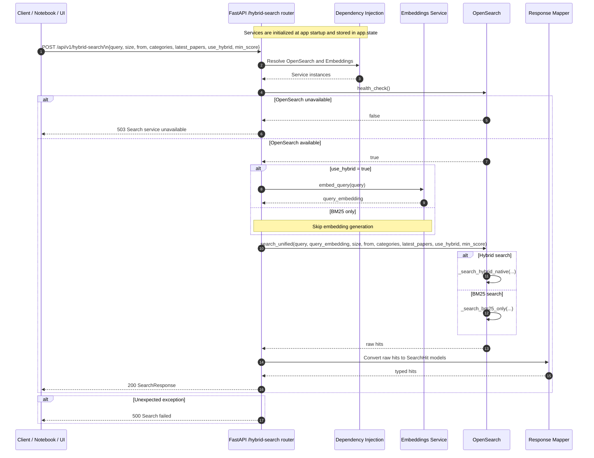

# `/api/v1/hybrid-search/` End-to-End Flow

This document explains how the Week 6 `POST /api/v1/hybrid-search/` endpoint works from the first HTTP request to the final JSON response.

It is written for contributors who want to understand the runtime control flow, the role of each component, and the exact handoff points between request validation, dependency injection, embeddings, retrieval, and response shaping.

Unlike `/api/v1/ask` and `/api/v1/stream`, this endpoint stops at retrieval. It does not call the LLM, does not use Redis caching, and does not emit streaming output.

## Sequence Diagram



## Step-by-Step Walkthrough

### 1. Application startup wires the services

When the API process starts, the FastAPI lifespan function creates the shared services and stores them on `app.state`. The `/hybrid-search/` endpoint relies on two of those startup-created services:

- the OpenSearch client
- the embeddings service

Code anchors:

- `lifespan(...)` in `src/main.py`
- router registration in `src/main.py`

Why it matters:

The route does not construct OpenSearch or embeddings clients during the request. It receives them through FastAPI dependency injection.

### 2. The client sends the request payload

The notebook or frontend sends a `POST` request to `/api/v1/hybrid-search/`. The payload is validated against `HybridSearchRequest`, which defines the endpoint's public contract.

The main inputs are:

- `query`: search text
- `size`: number of results to return
- `from`: pagination offset
- `categories`: optional category filters
- `latest_papers`: whether to sort for freshness instead of relevance
- `use_hybrid`: whether to include embedding-based retrieval
- `min_score`: score threshold for returned results

If the payload is invalid, FastAPI returns a validation error before the route body runs.

Code anchors:

- `HybridSearchRequest` in `src/schemas/api/search.py`
- `hybrid_search(...)` in `src/routers/hybrid_search.py`

### 3. FastAPI resolves request-scoped dependencies

Before entering the main route logic, FastAPI resolves the dependencies declared in the function signature:

- `opensearch_client`
- `embeddings_service`

Each of these is pulled from `request.app.state` by helper functions in `src/dependencies.py`.

Code anchors:

- `get_opensearch_client(...)` in `src/dependencies.py`
- `get_embeddings_service(...)` in `src/dependencies.py`

### 4. The route performs an OpenSearch health check first

Before doing any search work, the route verifies that OpenSearch is available by calling `opensearch_client.health_check()`.

If the health check fails, the route immediately raises `HTTPException(status_code=503, detail="Search service is currently unavailable")`.

Code anchors:

- health-check branch in `src/routers/hybrid_search.py`
- `health_check(...)` in `src/services/opensearch/client.py`

Why it matters:

This is the explicit availability gate for the endpoint. Retrieval is impossible without a working search backend, so the route fails fast.

### 5. The route optionally generates a query embedding

If `request.use_hybrid` is true, the route asks the embeddings service to generate a query embedding with `embed_query(request.query)`.

If embedding generation succeeds, the returned vector is passed into OpenSearch for hybrid retrieval.

If embedding generation fails, the route does not fail the request. Instead, it logs a warning and falls back to BM25-only retrieval by leaving `query_embedding` as `None`.

Code anchors:

- embedding branch in `src/routers/hybrid_search.py`

Why it matters:

This endpoint is designed to degrade gracefully. Embeddings improve retrieval quality for semantic matches, but they are not a hard dependency for the endpoint to return search results.

### 6. The route delegates retrieval to `search_unified(...)`

Once the request inputs are ready, the route calls `opensearch_client.search_unified(...)` and forwards all of the search controls:

- `query`
- `query_embedding`
- `size`
- `from_`
- `categories`
- `latest`
- `use_hybrid`
- `min_score`

Code anchors:

- route call in `src/routers/hybrid_search.py`
- `search_unified(...)` in `src/services/opensearch/client.py`

### 7. OpenSearch chooses BM25 or hybrid retrieval

Inside `search_unified(...)`, the OpenSearch client decides which retrieval path to use.

It returns BM25-only results when either:

- there is no query embedding
- `use_hybrid` is false

It returns native hybrid results when both of these are true:

- `use_hybrid` is true
- a query embedding is available

The two concrete internal paths are:

- `_search_bm25_only(...)`
- `_search_hybrid_native(...)`

Code anchors:

- `search_unified(...)` in `src/services/opensearch/client.py`
- `_search_bm25_only(...)` in `src/services/opensearch/client.py`
- `_search_hybrid_native(...)` in `src/services/opensearch/client.py`

### 8. The route maps raw search hits into API models

The raw OpenSearch response is not returned directly. Instead, the route iterates over `results.get("hits", [])` and converts each raw hit into a typed `SearchHit` model.

The mapped fields include:

- `arxiv_id`
- `title`
- `authors`
- `abstract`
- `published_date`
- `pdf_url`
- `score`
- `highlights`
- `chunk_text`
- `chunk_id`
- `section_name`

Code anchors:

- hit-mapping loop in `src/routers/hybrid_search.py`
- `SearchHit` in `src/schemas/api/search.py`

Why it matters:

This is the boundary between internal search engine output and the API contract exposed to callers.

### 9. The route builds a typed `SearchResponse`

After mapping the hits, the route creates a `SearchResponse` object containing:

- the original `query`
- the total number of returned results
- the typed `hits` list
- the requested `size`
- the `from` offset
- the effective `search_mode`

The route sets `search_mode` to:

- `"hybrid"` when `request.use_hybrid` is true and an embedding exists
- `"bm25"` otherwise

Code anchors:

- `SearchResponse` creation in `src/routers/hybrid_search.py`
- `SearchResponse` in `src/schemas/api/search.py`

Important implementation note:

The effective response mode depends on whether embedding generation actually succeeded, not only on the request flag. So a caller can request hybrid search and still receive `search_mode: "bm25"` if embedding generation fails.

### 10. The route returns the JSON response

If everything succeeds, FastAPI serializes the `SearchResponse` model and returns a standard JSON response.

Unlike `/ask` and `/stream`, there is:

- no Langfuse request trace
- no prompt construction
- no LLM generation
- no Redis caching
- no streaming response body

That makes `/hybrid-search/` the retrieval-only API surface.

### 11. Exceptions become HTTP errors

The route has two main failure paths:

- `503` when OpenSearch health check fails
- `500` when any unexpected runtime error occurs

Known `HTTPException` instances are re-raised directly. Unexpected exceptions are wrapped in `HTTPException(status_code=500, detail=f"Search failed: {str(e)}")`.

Code anchors:

- exception handling in `src/routers/hybrid_search.py`

## Component-Wise Explanation of Each Box

### Client / Notebook / UI

This is the caller. It sends the search parameters and consumes a standard JSON response.

Role in the flow:

- defines the search text and filters
- chooses BM25-only or hybrid retrieval
- provides pagination and score controls
- receives ranked search hits with metadata

### FastAPI `/hybrid-search` Router

This is the orchestration layer for retrieval-only requests. It validates the request, checks backend availability, triggers optional embedding generation, delegates retrieval, and shapes the final response.

Role in the flow:

- validates the request model
- performs the availability check
- handles embeddings fallback
- calls unified retrieval
- maps raw hits into API models
- returns `SearchResponse`

Main code anchor:

- `hybrid_search(...)` in `src/routers/hybrid_search.py`

### Dependency Injection

This is the bridge between startup-created services and request-time route logic.

Role in the flow:

- resolves the OpenSearch client
- resolves the embeddings service
- keeps the route body focused on search orchestration instead of client construction

### Embeddings Service

This service generates the semantic vector used for hybrid retrieval.

Role in the flow:

- transforms the user query into a query embedding
- enables the vector side of hybrid search
- can fail without breaking the endpoint because BM25 fallback is supported

### OpenSearch

This is the retrieval engine behind the endpoint.

Role in the flow:

- reports search-service health
- performs BM25 retrieval
- performs native hybrid retrieval when embeddings are available
- applies filters, pagination, relevance ordering, and score thresholds
- returns the raw hits that the route later maps into response models

Why it exists:

This endpoint is a search API, so OpenSearch is the core execution engine rather than a supporting component.

### Response Mapper

This is the route-level transformation step that converts raw OpenSearch documents into the typed `SearchHit` and `SearchResponse` models exposed by the API.

Role in the flow:

- normalizes raw hit fields
- stabilizes the public response schema
- keeps callers decoupled from raw OpenSearch response structure

## Request and Response Contracts

### Request

`HybridSearchRequest` expects:

```json
{
  "query": "transformers attention mechanism",
  "size": 8,
  "from": 5,
  "categories": ["cs.AI"],
  "latest_papers": true,
  "use_hybrid": true,
  "min_score": 0.0
}
```

### Response

`SearchResponse` returns:

```json
{
  "query": "transformers attention mechanism",
  "total": 8,
  "hits": [
    {
      "arxiv_id": "1234.5678",
      "title": "Attention Is Useful",
      "authors": "A. Researcher, B. Researcher",
      "abstract": "...",
      "published_date": "2024-12-01",
      "pdf_url": "https://arxiv.org/pdf/1234.5678.pdf",
      "score": 1.23,
      "highlights": {},
      "chunk_text": "...",
      "chunk_id": "abc123",
      "section_name": "Introduction"
    }
  ],
  "size": 8,
  "from": 5,
  "search_mode": "hybrid"
}
```

## Code Map

- `src/main.py`: application startup and router registration
- `src/dependencies.py`: request-time service resolution
- `src/routers/hybrid_search.py`: `/hybrid-search/` route orchestration
- `src/schemas/api/search.py`: request and response models for search
- `src/services/opensearch/client.py`: BM25 and hybrid retrieval implementation
- `tests/api/routers/test_hybrid_search.py`: endpoint contract coverage

## Related Week 6 Materials

- `notebooks/week6/week6_cache_testing.ipynb`
- `notebooks/week6/README.md`
- `notebooks/week6/ask-end-to-end-flow.md`
- `notebooks/week6/stream-end-to-end-flow.md`
