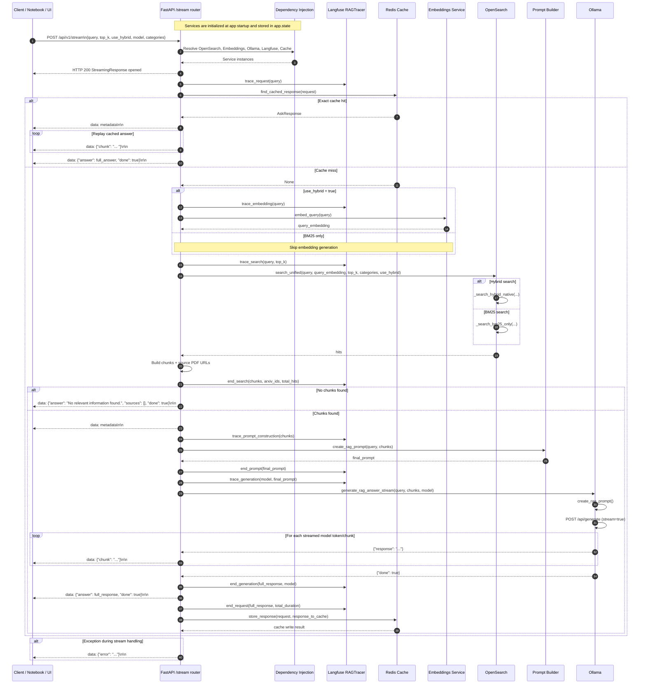

# `/api/v1/stream` End-to-End Flow

This document explains how the Week 6 `POST /api/v1/stream` endpoint works from the first HTTP request to the final streamed output.

It is written for contributors who want to understand the runtime control flow, the role of each component, and the exact handoff points between routing, retrieval, prompt construction, streaming generation, caching, and tracing.

## Sequence Diagram



## Step-by-Step Walkthrough

### 1. Application startup wires the services

When the API process starts, the FastAPI lifespan function creates the shared services and stores them on `app.state`. That includes OpenSearch, the embeddings client, the Ollama client, the Langfuse tracer, and the Redis cache client.

Code anchors:

- `lifespan(...)` in `src/main.py`
- `app.include_router(...)` in `src/main.py`

Why it matters:

The `/stream` route receives already-initialized service instances through FastAPI dependency injection instead of constructing them per request.

### 2. The client sends the request payload

The notebook, Gradio UI, or another client sends a `POST` request to `/api/v1/stream`. The payload is validated against `AskRequest`, the same request model used by `/ask`.

That means the streaming endpoint accepts the same core inputs:

- `query`
- `top_k`
- `use_hybrid`
- `model`
- `categories`

If the payload is invalid, FastAPI returns a validation error before any streaming starts.

Code anchors:

- `AskRequest` in `src/schemas/api/ask.py`
- `ask_question_stream(...)` in `src/routers/ask.py`

### 3. FastAPI resolves request-scoped dependencies

Before the route body runs, FastAPI resolves the declared dependencies for search, embeddings, generation, tracing, and caching from `request.app.state`.

Code anchors:

- `get_opensearch_client(...)` in `src/dependencies.py`
- `get_embeddings_service(...)` in `src/dependencies.py`
- `get_ollama_client(...)` in `src/dependencies.py`
- `get_langfuse_tracer(...)` in `src/dependencies.py`
- `get_cache_client(...)` in `src/dependencies.py`

### 4. The route returns a `StreamingResponse` wrapper immediately

Unlike `/ask`, this route does not compute the full answer before creating the HTTP response object. It returns a `StreamingResponse` that wraps the inner async generator `generate_stream()`.

The response is configured with:

- `media_type="text/plain"`
- `Cache-Control: no-cache`
- `Connection: keep-alive`

Code anchors:

- final `StreamingResponse(...)` in `src/routers/ask.py`

Why it matters:

The HTTP connection stays open while the generator yields multiple payload chunks over time.

### 5. The generator opens a Langfuse request trace

Inside `generate_stream()`, the route creates `RAGTracer(langfuse_tracer)` and opens the top-level request trace. This trace covers cache lookup, retrieval, prompt construction, and generation.

Code anchors:

- `generate_stream()` in `src/routers/ask.py`
- `trace_request(...)` in `src/services/langfuse/tracer.py`

### 6. The route checks Redis before doing expensive work

The first runtime branch is the cache lookup using the same exact-match strategy as `/ask`. If a cached `AskResponse` is found, the route does not call OpenSearch or Ollama.

Instead, it replays the cached answer as a stream.

Code anchors:

- `find_cached_response(...)` in `src/services/cache/client.py`
- cache-hit branch in `src/routers/ask.py`

### 7. On cache hit, the route replays a synthetic stream

When Redis returns a cached response, the route yields three kinds of messages in order:

1. A metadata event containing `sources`, `chunks_used`, and `search_mode`
2. A sequence of chunk events generated by splitting the cached answer on whitespace
3. A final completion event containing the full answer and `done: true`

Code anchors:

- cached stream replay branch in `src/routers/ask.py`

Important implementation note:

This is not token-for-token replay from the original model stream. The cached answer is reconstructed into chunk messages using `cached_response.answer.split()`, so cached streaming behavior is approximate rather than identical to the original Ollama output cadence.

### 8. On cache miss, the route retrieves chunks

If the cache misses, the route calls `_prepare_chunks_and_sources(...)`, the same retrieval helper used by `/ask`.

That helper:

1. Generates a query embedding when hybrid search is enabled
2. Runs OpenSearch retrieval
3. Normalizes results into LLM-ready chunk dictionaries and source URLs

Code anchors:

- `_prepare_chunks_and_sources(...)` in `src/routers/ask.py`

### 9. Embeddings are generated only when hybrid search is active

If `request.use_hybrid` is true, the route traces the embedding call and asks the embeddings service for a query vector. If embedding generation fails, retrieval falls back to BM25-only search rather than failing the whole request.

Code anchors:

- embedding branch in `src/routers/ask.py`
- `trace_embedding(...)` in `src/services/langfuse/tracer.py`

### 10. OpenSearch chooses BM25 or native hybrid retrieval

The route calls `opensearch_client.search_unified(...)`, which internally chooses between BM25-only retrieval and native hybrid retrieval.

Code anchors:

- `search_unified(...)` in `src/services/opensearch/client.py`
- `_search_bm25_only(...)` in `src/services/opensearch/client.py`
- `_search_hybrid_native(...)` in `src/services/opensearch/client.py`

### 11. The route converts raw hits into LLM-ready chunks

The retrieval helper extracts only the minimal generation context from each search hit:

- `arxiv_id`
- `chunk_text` or fallback `abstract`

It also derives the list of source PDF URLs from the arXiv IDs.

Code anchors:

- chunk extraction logic in `src/routers/ask.py`

### 12. If there are no chunks, the route yields one terminal message

If retrieval returns no chunks, the generator yields a single completion-style message with:

- fallback answer text
- empty `sources`
- `done: true`

Then it stops.

Code anchors:

- no-results streaming branch in `src/routers/ask.py`

### 13. On retrieval success, the route sends metadata first

Before any model-generated text is streamed, the route sends a metadata message containing:

- `sources`
- `chunks_used`
- `search_mode`

This gives the client retrieval context before the answer tokens begin to arrive.

Code anchors:

- metadata message creation in `src/routers/ask.py`

### 14. The route constructs a prompt for trace visibility

The streaming route creates a `RAGPromptBuilder`, builds a prompt with `create_rag_prompt(...)`, and records it in the Langfuse prompt span.

Code anchors:

- prompt construction block in `src/routers/ask.py`

### 15. Ollama streams generation chunks back through the route

The route calls `ollama_client.generate_rag_answer_stream(...)`, which internally builds a RAG prompt and then calls `generate_stream(...)` with `stream=True`.

As the Ollama API yields newline-delimited JSON messages, the route forwards each text fragment to the client as a `data: {"chunk": ...}` event and accumulates the full answer in `full_response`.

Code anchors:

- `generate_rag_answer_stream(...)` in `src/services/ollama/client.py`
- `generate_stream(...)` in `src/services/ollama/client.py`

Important implementation note:

As with `/ask`, prompt construction happens twice in the current implementation: once in the router for tracing, and again inside `OllamaClient.generate_rag_answer_stream(...)` for the actual model request.

### 16. The route closes the stream with a final answer event

When Ollama sends a chunk with `done: true`, the route:

1. Ends the Langfuse generation span
2. Yields a final completion event containing the full answer and `done: true`
3. Breaks out of the stream loop

Code anchors:

- done-handling branch in `src/routers/ask.py`

### 17. The route finalizes tracing and stores the answer in Redis

After streaming completes successfully, the route records the final answer and total duration in the request trace.

If `full_response` is non-empty, it also wraps that streamed answer in an `AskResponse` and stores it in Redis using the same exact-match key strategy as `/ask`.

Code anchors:

- `end_request(...)` in `src/services/langfuse/tracer.py`
- cache write block in `src/routers/ask.py`

Why it matters:

This is what allows a later identical `/stream` request to bypass live generation and replay a cached stream.

### 18. Errors are streamed as data messages

If an exception occurs after the streaming response has started, the route cannot switch to a normal FastAPI error response. Instead, it yields a final error message in the stream:

```json
{"error": "..."}
```

Code anchors:

- exception handler inside `generate_stream()` in `src/routers/ask.py`

## Component-Wise Explanation of Each Box

### Client / Notebook / UI

This is the consumer of the stream. It opens the HTTP connection, reads incremental `data:` messages, and reconstructs the final answer progressively.

Role in the flow:

- sends the input payload
- reads metadata before answer text
- appends answer chunks as they arrive
- watches for `done: true` to know the stream is complete

### FastAPI `/stream` Router

This is the orchestration layer for streamed responses. It coordinates retrieval, prompt construction, generation, and caching while yielding partial output to the client.

Role in the flow:

- validates the request model
- returns a `StreamingResponse`
- checks cache first
- emits metadata events
- forwards chunk events
- emits final answer or error events

Main code anchor:

- `ask_question_stream(...)` in `src/routers/ask.py`

### Dependency Injection

This is the bridge between startup-created services and per-request route logic. It keeps the route body focused on orchestration rather than service construction.

Role in the flow:

- resolves OpenSearch, embeddings, Ollama, Langfuse, and cache clients
- centralizes service access through typed dependencies

### Langfuse `RAGTracer`

This is the observability wrapper around the streaming RAG path.

Role in the flow:

- request-level trace lifecycle
- embedding span
- retrieval span
- prompt construction span
- generation span
- final latency and answer recording

Why it exists:

Streaming makes latency feel better to the user, but tracing is still needed to understand where time is spent across retrieval and generation.

### Redis Cache

This is the exact-match optimization layer for repeated streamed requests.

Role in the flow:

- short-circuits duplicate requests
- stores the completed stream output as a regular `AskResponse`
- enables replay of a synthetic cached stream on later requests

Important nuance:

The cached stream is not the original token stream. It is reconstructed from the final answer text.

### Embeddings Service

This service generates query embeddings for hybrid retrieval when enabled.

Role in the flow:

- enriches semantic retrieval
- is optional because BM25 fallback is allowed

### OpenSearch

This is the retrieval engine that finds the chunks the model will use to answer the question.

Role in the flow:

- ranks relevant chunks with BM25 or hybrid search
- returns metadata used for source attribution
- provides the evidence context for the stream

### Prompt Builder

This component formats the user query and retrieved chunks into the prompt sent to the model.

Role in the flow:

- creates the trace-visible prompt in the router
- creates the generation prompt again inside the Ollama client

Important nuance:

The streaming implementation duplicates prompt construction across the router and client layers, just like the non-streaming path.

### Ollama

This is the token-producing generation engine. It streams incremental response fragments from the local model endpoint.

Role in the flow:

- receives the prompt and model name
- returns streaming JSON messages over the Ollama HTTP API
- drives the partial-answer experience seen by the client

## Stream Message Contract

The `/stream` endpoint does not return a single JSON object. It yields multiple `data:` messages over a `text/plain` streaming response.

### Metadata message

This is sent before streamed answer text on cache miss, and also on cache hit replay:

```json
{
  "sources": ["https://arxiv.org/pdf/1234.5678.pdf"],
  "chunks_used": 3,
  "search_mode": "hybrid"
}
```

### Chunk message

This is sent repeatedly while answer text is being streamed:

```json
{
  "chunk": "Transformers use self-attention..."
}
```

### Completion message

This marks the end of a successful stream:

```json
{
  "answer": "Full accumulated answer text",
  "done": true
}
```

### Error message

If a runtime failure occurs after the stream has started, the route emits:

```json
{
  "error": "Failure details"
}
```

## Code Map

- `src/main.py`: application startup and router registration
- `src/dependencies.py`: request-time service resolution
- `src/routers/ask.py`: `/ask` and `/stream` endpoint orchestration
- `src/schemas/api/ask.py`: shared request and cached-response model
- `src/services/cache/client.py`: exact-match Redis caching
- `src/services/opensearch/client.py`: BM25 and hybrid retrieval
- `src/services/ollama/client.py`: streaming LLM generation
- `src/services/langfuse/tracer.py`: tracing lifecycle and span helpers

## Related Week 6 Materials

- `notebooks/week6/week6_cache_testing.ipynb`
- `notebooks/week6/README.md`
- `notebooks/week6/ask-end-to-end-flow.md`
